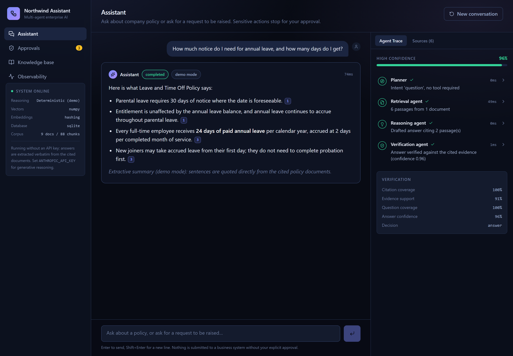
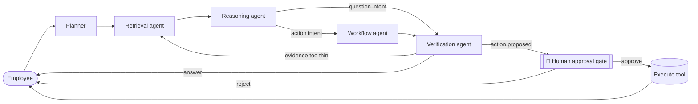
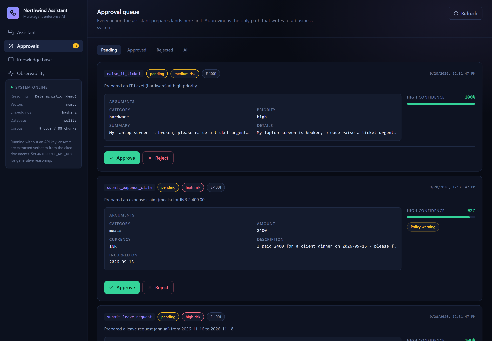
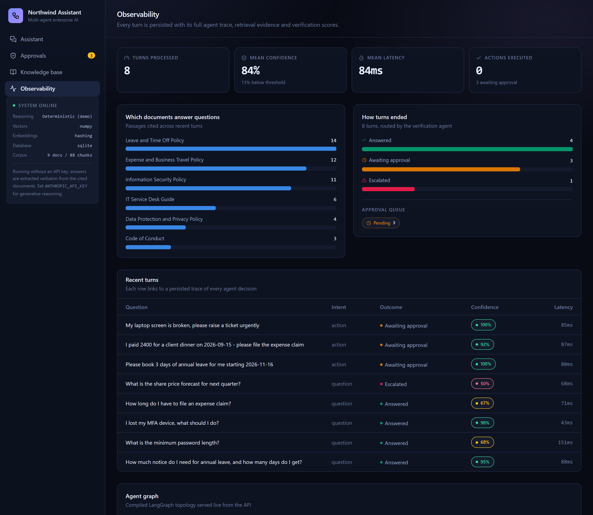

# Enterprise Multi-Agent AI Assistant

A multi-agent, retrieval-augmented assistant that answers company policy
questions and completes HR/finance/IT workflows — with every business action
stopped at a human approval gate before it executes.

> *"Summarize our leave policy and help me submit a leave request."*
> A **retrieval agent** searches company documents. A **reasoning agent**
> answers with citations. A **workflow agent** prepares the request. A
> **verification agent** checks the answer and flags uncertainty. A **human**
> approves before anything sensitive happens.

**[Live demo →](https://northwind-assistant.onrender.com)** &nbsp;·&nbsp;
[](https://render.com/deploy?repo=https://github.com/pardhu0201/enterprise-multi-agent-assistant)

Runs for free (Render's free web-service tier — sleeps after 15 minutes idle,
~50s to wake on the next request) in deterministic "demo mode" with no API
key, and upgrades in place to Claude Opus 5 reasoning when one is supplied.
Click **Deploy to Render** to spin up your own copy in about 3 minutes.



---

## Why this exists

This is a portfolio project built to demonstrate, with working code rather
than slides, the core patterns behind production agentic AI systems:

- **Multi-agent orchestration** — five agents coordinated by a compiled
  [LangGraph](https://github.com/langchain-ai/langgraph) state machine, with
  conditional routing, a bounded retry loop, and a persisted per-run trace.
- **Retrieval-augmented generation done properly** — heading-aware chunking,
  hybrid BM25 + vector search fused by score *and* rank, near-duplicate
  suppression, and a heading-relevance boost. Every claim in an answer carries
  a `[n]` citation the reader can click through to source text.
- **Context engineering** — five agents, five narrow system prompts; each one
  gets exactly the context its job needs and nothing else, so the reasoning
  agent never sees tool schemas and the planner never sees document text.
- **Human-in-the-loop governance** — the agent graph can *propose* a business
  action but is physically incapable of *executing* one. Execution is a
  separate code path reachable only from an approval decision.
- **Verification that doesn't trust an LLM to grade an LLM** — the
  verification agent runs deterministic groundedness checks (citation
  validity, IDF-weighted evidence support, numeric-hallucination detection,
  question-vs-corpus coverage) *first*, and treats a model's own confidence as
  a second opinion, never the only one.
- **A measured system, not a vibe** — `backend/evals/` is a golden-set
  evaluation harness that scores routing accuracy, retrieval recall@k/MRR,
  citation validity, groundedness, and human-gate enforcement, and fails CI if
  any of them regress.

## Architecture



| Agent | Responsibility | Can it act on a system of record? |
|---|---|---|
| **Planner** | Classifies intent (question / action / mixed / smalltalk), writes retrieval queries | No |
| **Retrieval** | Hybrid BM25 + vector search, reciprocal-rank + score fusion, near-dup suppression | No — read-only over the corpus |
| **Reasoning** | Answers using *only* retrieved passages, with `[n]` citations | No |
| **Workflow** | Validates arguments against a Pydantic schema, runs a live-data preflight | No — prepares a proposal only |
| **Verification** | Deterministic groundedness/safety checks + model second opinion → routes the turn | No |
| **Human approval gate** | The only path that can call a tool's `execute()` | **Yes**, after a person decides |

A full request/response reference, the retrieval design, and the verification
scoring model are documented in [`docs/ARCHITECTURE.md`](docs/ARCHITECTURE.md).

## Tech stack

| Layer | Choice |
|---|---|
| Agent orchestration | Python, **LangGraph**, LangChain text splitters |
| LLM | **Claude Opus 5** (Anthropic API) — optional; deterministic fallback runs with zero cost/keys |
| API | **FastAPI**, Pydantic v2, Server-Sent Events for live agent streaming |
| Retrieval | Hybrid BM25 + hashing/sentence-transformer embeddings, **pgvector** (or in-process numpy) |
| Database | **PostgreSQL** in production, SQLite with zero setup for local dev/CI |
| Frontend | **React 19**, TypeScript, Tailwind v4, Vite |
| Tests / evals | pytest (56 tests), a golden-set eval harness, ruff |
| CI/CD | GitHub Actions — lint, tests, evals, and a full Docker boot-and-healthcheck |
| Deployment | Single Docker image (frontend baked into the FastAPI static root) — free-tier ready on Hugging Face Spaces, Render, or Fly |

## Screenshots

| | |
|---|---|
|  |  |
| Every proposed action queues here — nothing writes to a system of record without a human decision. | Persisted trace of every turn: routing accuracy, retrieval quality, confidence calibration. |

## Quick start

### Option A — Docker (recommended, matches production)

```bash
git clone https://github.com/pardhu0201/enterprise-multi-agent-assistant.git
cd enterprise-multi-agent-assistant
docker build -t northwind-assistant .
docker run -p 7860:7860 northwind-assistant
# open http://localhost:7860
```

No environment variables required — it boots on SQLite in deterministic demo
mode. Add `-e ANTHROPIC_API_KEY=sk-...` to switch on Claude reasoning.

### Option B — local dev (hot reload, separate frontend/backend)

```bash
# Backend
cd backend
python -m venv .venv && .venv/Scripts/activate   # or source .venv/bin/activate
pip install -r requirements-dev.txt
uvicorn app.main:app --reload --port 8000

# Frontend (separate terminal)
cd frontend
npm install
npm run dev    # http://localhost:5173, proxies /api to :8000
```

Copy `.env.example` to `.env` in the repo root to configure an API key,
Postgres URL, or embedding provider — every setting has a working default.

### Run the tests and the evaluation harness

```bash
cd backend
pytest -q                         # 56 tests: RAG, tools, verification, full API
python -m evals/run_eval.py       # routing/retrieval/citation/safety scorecard
```

## How the free demo works

With no `ANTHROPIC_API_KEY`, every agent falls back to a **deterministic**
implementation instead of a model call:

- the planner uses keyword/intent heuristics,
- the reasoning agent becomes **extractive** — it selects and quotes the
  highest-scoring sentences from the retrieved evidence rather than
  generating prose, so it is structurally incapable of hallucinating,
- the workflow agent uses a regex/date-parsing extractor for tool arguments.

The retrieval, verification, approval-gate, and persistence layers are
**identical** in both modes. Supplying an API key swaps only the reasoning
layer — nothing else in the graph changes — which is what makes the
zero-cost public demo a faithful preview of the full system.

## Deployment

Full instructions (Hugging Face Spaces, Render, Vercel + Render, Docker
Compose with Postgres) are in [`docs/DEPLOYMENT.md`](docs/DEPLOYMENT.md).

## Project layout

```
backend/
  app/
    agents/        # LangGraph nodes: planner, retrieval, reasoning, workflow, verification
    rag/            # chunking, embeddings, hybrid retriever, ingestion
    tools/          # business-tool schemas, registry, deterministic implementations
    llm/            # Anthropic client wrapper (structured outputs, refusal fallback)
    api/            # FastAPI routers
    db/              # SQLAlchemy models, engine, seed data
  data/corpus/      # 9 seed policy documents (leave, expenses, security, ...)
  evals/            # golden-set evaluation harness
  tests/            # 56 pytest tests
frontend/
  src/
    pages/          # Assistant, Approvals, Knowledge base, Observability
    components/     # AgentTimeline, AnswerBody (citations), ActionCard, SourcePanel
    lib/api.ts      # typed client + SSE stream parser
docs/               # architecture notes, deployment guide, screenshots
```

## License

MIT — see [LICENSE](LICENSE).
